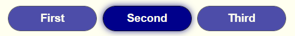

# Selector
Allows the user to select a value out of a set of values.

Element: \<maf-selector\>

## Example

    <maf-selector [(value)]="selected">
         <maf-option label="First" value="A"></maf-option>
         <maf-option label="Second" value="B"></maf-option>
         <maf-option label="Third" value="C"></maf-option>
    </maf-selector>

Results in:

    

## Usage
Add an `<option>` element for each value of the set. Specify its value via the `value` property and the text to represent it via either the `<label>` or `<labelId>` property.

Bind the `value` attribute of the `maf-selection` element 'two-way' to a variable. For instance, the "banana in a box" notation `[(value)]=selected` binds the value selected by the user to the `selected` property. By setting the value of that `selected` property to one of the option values, one can select the corresponding option. If the value doesn't correspond to any of the option values, none of the option buttons will be selected.

